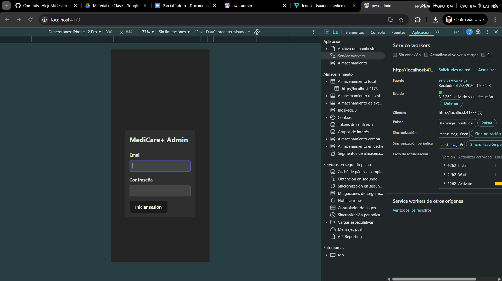
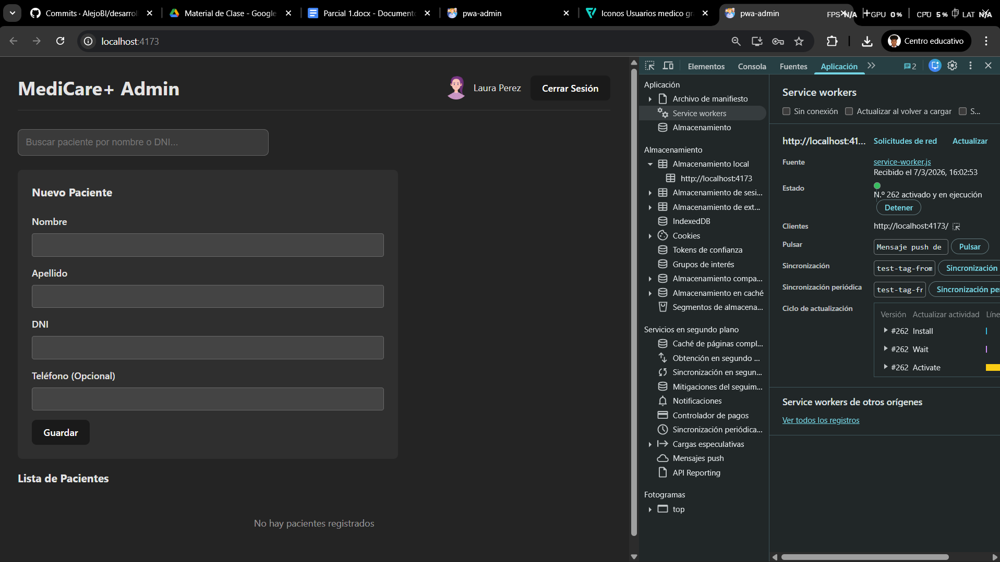
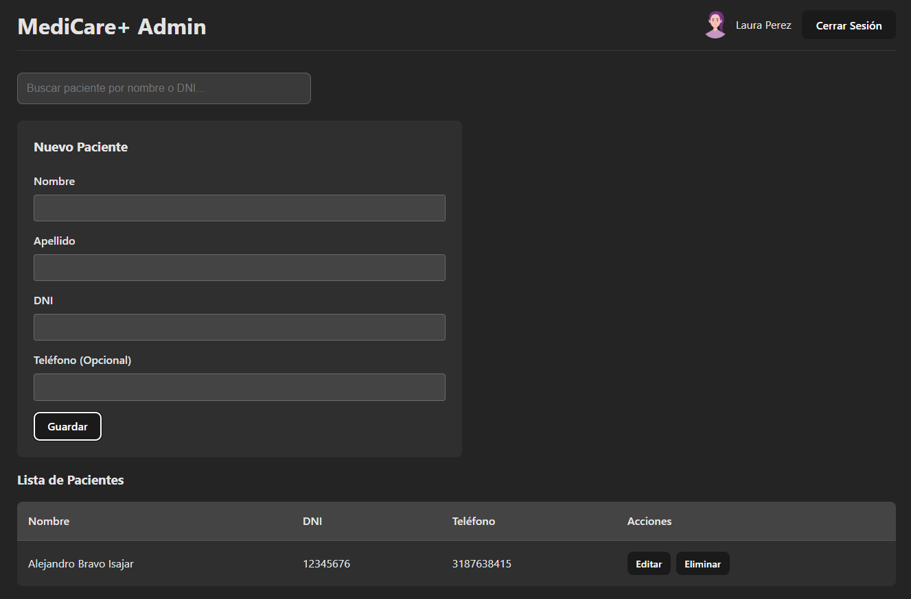
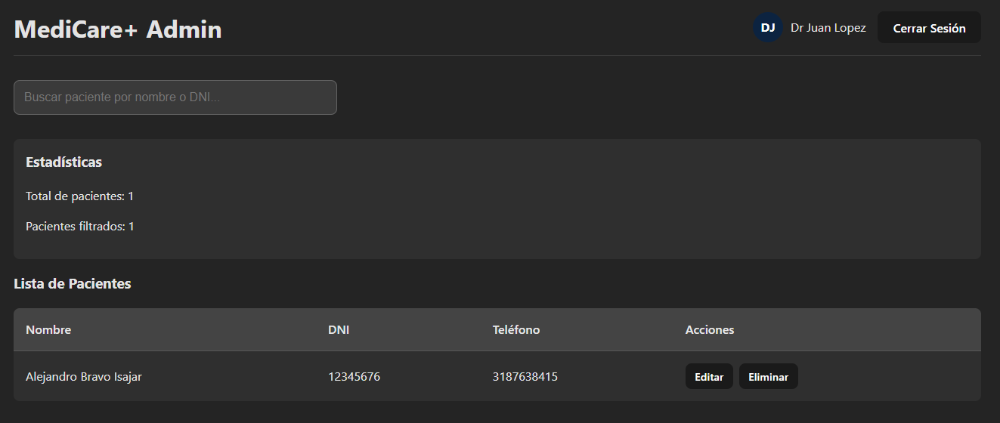
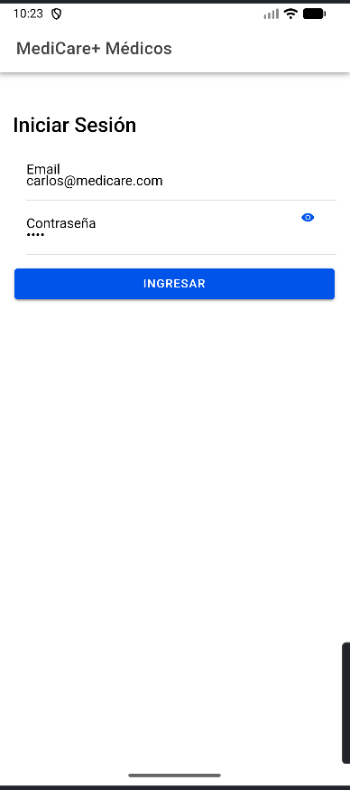
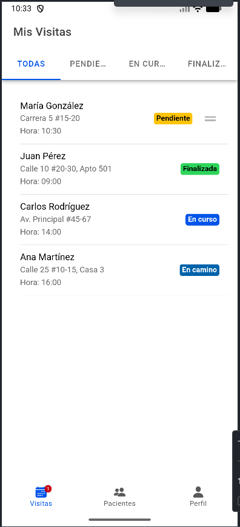
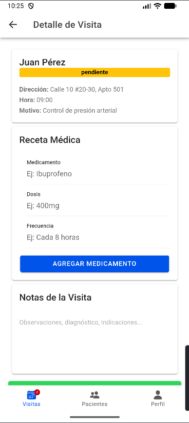
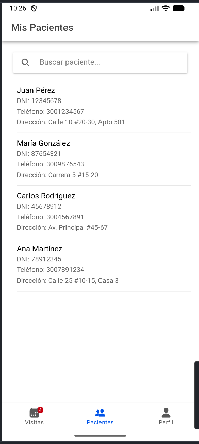
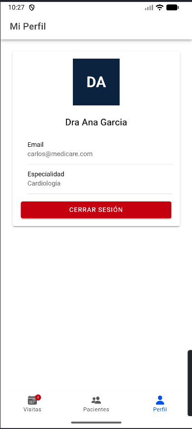

# MediCare+ – Parcial 1

Proyecto del **Parcial 1 – Desarrollo de Plataformas Móviles** que consiste en dos aplicaciones: una **PWA en React** para la administración de pacientes desde escritorio, y una **App móvil en Ionic React** para la gestión de visitas médicas a domicilio.

---

## Ejercicio 1: PWA Admin (React + TypeScript)

Aplicación web progresiva para la administración de pacientes desde navegador de escritorio.

### Tecnologías
- React 19.2.0
- TypeScript
- Vite
- localStorage
- PWA (Manifest + Service Worker)

### Funcionalidades
- Login con autenticación simulada
- Gestión de pacientes (crear, editar, eliminar)
- Buscador de pacientes por nombre, apellido o DNI
- Perfil de usuario con avatar e iniciales
- Control de acceso por rol (médico/recepcionista)
- Persistencia con localStorage

### Instalación y ejecución

```bash
cd pwa-admin
npm install
npm run dev
```

### Credenciales de acceso
- Recepcionista: `recepcionista@medicare.com` / `1234`
- Médico: `medico@medicare.com` / `1234`

### Capturas de pantalla

#### Login y Configuración PWA


#### Dashboard Recepcionista


#### Perfil de Usuario


#### Dashboard Médico


---

## Ejercicio 2: App Móvil Médicos (Ionic React + TypeScript)

Aplicación móvil para médicos domiciliarios que gestiona visitas, pacientes y recetas.

### Tecnologías
- Ionic React 8.4.0
- React 19.2.0
- TypeScript
- React Router
- localStorage

### Componentes Ionic utilizados
- IonItemSliding (deslizar para acciones)
- IonReorderGroup (reordenar visitas)
- IonSegment (filtros por estado)
- IonAlert (confirmación de cancelación)
- IonBadge (contador de visitas pendientes)
- IonAvatar (foto o iniciales del médico)
- IonToast (mensajes de error)
- IonLoading (simulación de carga)
- IonSearchbar (buscar pacientes)
- IonTabs (navegación inferior)

### Funcionalidades
- Login con toggle de contraseña
- Lista de visitas con filtros (Todas/Pendientes/En curso/Finalizadas)
- Reordenar visitas pendientes por drag & drop
- Deslizar visitas para acciones rápidas
- Sistema de prescripción tipo carrito
- Búsqueda de pacientes
- Perfil con avatar/iniciales
- Badge con contador de visitas pendientes

### Instalación y ejecución

```bash
cd ionic-medicos
npm install
npm run dev
```

### Credenciales de acceso
- Médico 1: `medico@medicare.com` / `1234`
- Médico 2: `carlos@medicare.com` / `1234`

### Ejecutar en Android Studio

#### Paso 1: Agregar plataforma Android (solo la primera vez)

```bash
npx cap add android
```

Este comando crea la carpeta `android` con toda la configuración necesaria para el proyecto nativo.

#### Paso 2: Compilar y abrir en Android Studio

**Opción 1: Comando completo (recomendado)**

```bash
ionic build; npx cap copy android; npx cap sync android; npx cap open android
```

Este comando:
1. Compila la app (`ionic build`)
2. Copia los cambios a Android (`npx cap copy android`)
3. Sincroniza las dependencias (`npx cap sync android`)
4. **Abre automáticamente Android Studio** con la carpeta android ya configurada

Android Studio se abrirá en una ventana nueva con el proyecto listo. Solo debes:
1. Esperar a que se cargue el proyecto
2. Seleccionar el emulador en la lista de dispositivos
3. Presionar **Run** (botón Play)

**Opción 2: Paso a paso**

Si prefieres hacerlo manualmente:

```bash
ionic build
npx cap copy android
npx cap sync android
```

Luego abre manualmente Android Studio desde tu computadora y ve a:
- Archivo → Abrir → Selecciona la carpeta `android` del proyecto
- Espera a que cargue
- Selecciona el emulador y presiona **Run**

O usa este comando para abrir Android Studio directamente:

```bash
ionic cap open android
```

### Capturas de pantalla

#### Login


#### Lista de Visitas


#### Detalle de Visita


#### Mis Pacientes


#### Perfil Médico


---

## Autor

**Alejandro Bravo**  
Universidad Autónoma de Occidente